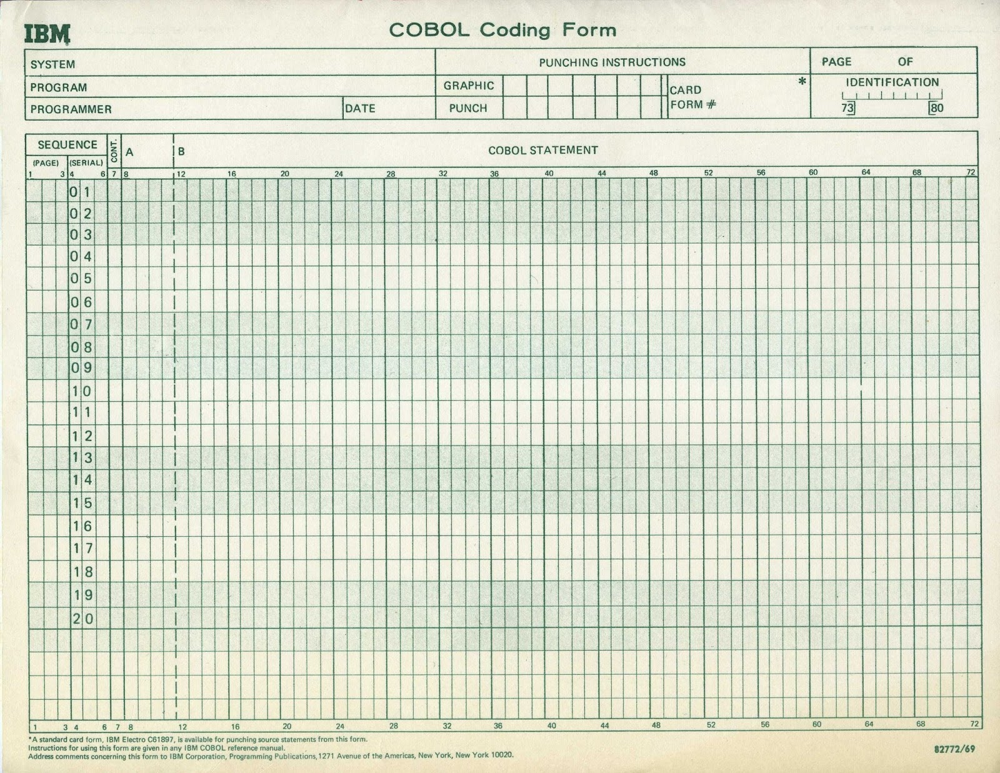

# Capítulo 3 - Introducción a los lenguajes de programación.  Lenguaje COBOL.

## 3.1. Introducción a los lenguajes de programación. Lenguaje COBOL

El lenguaje COBOL es un lenguaje de alto nivel, orientado a la gestión comercial
y de tipo compilado.  Sus instrucciones se codifican utilizando reglas semejantes a la construcción de frases en inglés.


## 3.1. Historia y características del lenguaje COBOL

TODO

## 3.2. Estructura de un programa COBOL

Todo programa COBOl está compuesto por cuatro grandes partes, denominadas **divisiones**.
Las divisiones se deben escribir todas, y en el orden especificado:

* `IDENTIFICATION DIVISION`: identifica al programa con su nombre, autor, fecha y restricciones de uso.
* `ENVIRONMENT DIVISION`: especifica las características del computador y los periféricos usados.
* `DATA DIVISION`: se definen los datos usados por el programa, indicando en cada caso el nombre, tipo y tamaño.
* `PRECEDURE DIVISION`: aquí están las instrucciones que se ejecutarán en el programa.


Estructura general de un fuente COBOL:

```text
IDENTIICATION DIVISION.

PROGRAM ID. nombre-del-programa
[AUTHOR. [comentario] ... ]
[INSTALLATION. [comentario] ...]
[DATE-WRITTEN. [comentario] ...]
SECURITY. [ comentario] ...]


ENVIRONMENT DIVISION.

CONFIGURATION SECTION.
SOURCE-COMPUTER. nombre-de-computador.
OBJECT-COMPUTER. nombre-de-computador.
[SPECIAL-NAMES. [declaracion-de-nombres-especiales] ...]

[INPUT-OUTPUT SECTION.
FILE-CONTROL. {declaracion-de-control-de-archivos} ...
[I-O-CONTROL. [declaracion-de-control-de-entrada-salida.] ] ]


DATA-DIVISION.

[FILE SECTION.
  [declaracion-de-descripcion-de-archivo.
  [declaracion-de-descripcion-de-registro.] ...] ...]

[WORKING-STORAGE SECTION.
  [declaracion-de-campos-de-nivel-77.] ...
  [declaracion-de-descripcion-de-registro.] ...]

[LINKAGE SECTION.
  [declaracion-de-campos-de-nivel-77.] ...
  [declaracion-de-descripcion-de-registro.] ...]
  
[REPORT SECTION.
  [declaracion-de-descripcion-de-informes.
  [declaracion-de-descripcion-de-grupo-de-informe.] ...] ...]


PROCEDURE DIVISION.

[DECLARATIVES.
[nombre-de-seccion SECTION
  sentencia-declarativa
  [nombre-de-parrafo [sentencia] ...] ...] ...
END DECLARATIVES.]

[nombre-de-seccion SECTION
[nombre-de-parrafo. [sentencia] ...] ...] ...

[END PROGRAM].

```

## 3.4. Elementos del lenguaje COBOL: caracteres y palabras

La unidad más elemental e indivisible en COBOL es el **carácter**.  Los carácteres pueden ser de varios tipos:

* *numéricos*: dígitos entre 0 y 9
* *alfabéticos*: letras ASCII entre "a" y "z", letras entre "A" y "Z"; las letras acentuadas y las eñes no están incluídas.
* *especiales*: `( ) " + - * / = $ , ; < >`
* *adoptados*: "£" en Gran Bretaña, "Ñ" en España, "ç" en Francia, etc.

La combinación de caracteres da lugar a **palabras**. Las palabras pueden ser:

* **palabras reservadas**: tienen un significado predefinido por el COBOL y no es necesario definirlas. Ej.: `AUTHOR`, `INSTALLATION`, `STOP`, etc.
  * constantes figurativas
  * verbos, procedimientos y cláusulas
* **palabras definidas por el programador**: creadas para el programa, las más usuales son los nombres de datos. Ej.: `DNI`, `DOMICILIO`, `SUELDO`, etc.
  * nombres de datos
  * nombres de archivos
  * nombres de párrafo o procedimiento
  * nombres de dispositivo
  * nombres calificados

## 3.5. Palabras definidas por el programador

Veremos el significado y sus reglas de formación.

### 3.5.1. Nombres de datos

Referencias una posición en la memoria del computador, donde está almacenado el valor asociado al nombre de dato.

Deben definirse los nombres de dato en la `DATA DIVISION`.

Para cada nombre se debe especificar el tipo y el tamaño.

### 3.5.2. Nombres de párrafo y procedimiento

**Procedimiento**: *conjunto de instrucciones que se agrupan porque llevan a cabo un proceso determinado; se pueden ejecutar varias veces y llamarse desde distintos puntos del programa.*

**Párrafo**: *conjunto de sentencias COBOL*

### 3.5.3. Nombres de archivo

Son nombres simbólicos que se usan dentro del programa para hacer referencia a *estructuras*  y a los *soportes físicos*  de los datos.

En [Cap 6](06-estructuras-externas.md) se estudiarán los archivos.

### 3.5.4. Nombres de dispositivos periféricos

Identifican un equipo periférico, tal como *impresora*, *disco*, etc.  Dependen del compilador de COBOL utilizado.  Se recomienda consultar el manual del COBOL utilizado.

### 3.5.5. Nombres calificados

Es conveniente utilizar identificadores únicos para cada dato.

Cuando necesitamos usar los mismos nombres, se debe usar un *calificador* que evite la confusión en el compilador

Los calificadores se forman añadiendo las palabras reservadas `OF` o `IN` a los campos de igual nombre, calificándolos con otro identificados, éste si es diferente.

Ejemplo:

```text
  NOMBRE OF EMPLEADO1
  NOMBRE OF EMPLEADO2
```

La ambigüedad en `NOMBRE` desaparece cuando sabemos que es del campo `EMPLEADO1`.

Hay otros nombres definidos por el programador, que se verán más adelante.

### 3.5.6. Reglas de formación de los nombres definidos por el programador

Para **nombres de dato** y **nombres de archivo** las restricciones son:

* caracteres alfabéticos (sin espacios ni eñe)
* pueden usarse dígitos
* puede usarse el guión (`-`)

Ejemplos: `SUELDO`, `APELLIDO-1`

No son válidos: `AÑO`, `APELLIDO 1`

* 30 caracteres es el máximo de longitud para el nombre
* el guión no puede usarse al principio ni al final del nombre, aunque sí en medio
* al menos debe haber un caracter alfabético en la primera posición del nombre
* no se pueden usar signos de puntuación como `, . ;`
* no se pueden usar palabras reservadas

Para **nombres de párrafo** y **nombres de procedimiento** en la `PROCEDURE DIVISION` van las mismas restricciones, 
con la salvedad que no es obligatoria la aparición de un carácter alfabético en el nombre.


## 3.6. Palabras reservadas

Las palabras reservadas tienen un significado predefinido por el compilador.

Son de varios tipos.

### 3.6.1. Constantes figurativas

Es indiferente el uso de singular o plural en el nombre de la constante figurativa.

| constante figurativa | Descripción |
|----------------------|-------------|
| `ZERO`<br>`ZEROS`<br>`ZEROES` | Es el valor cero. Se puede usar como valor numérico en operaciones aritméticas o como literal alfanumérico. |
| `SPACE`<br>`SPACES` | Uno o más espacios en blanco. |
| `QUOTE`<br>`QUOTES` | Una o más comillas.  Como los literales alfanuméricos se ponen entre comillas, se necesita esta constante si se quiere incluirla en un literal. |
| `ALL "Literal"`   | genera tantas apariciones del literal especificado como longitud tenga el campo. | 
| `HIGH-VALUE`<br>`HIGH-VALUES` | el *mayor valor* posible para un dato numerico o alfanumérico, o sea, todo otro dato es menor a él. |
| `LOW-VALUE`<br>`LOW-VALUES` | el *menor valor* posible para un dato numerico o alfanumérico, o sea, todo otro dato es mayor a él. |


### 3.6.2. Verbos, instrucciones y cláusulas

Los verbos en COBOL indican acciones.  Hay de varios tipos: de entrada, de salida, aritméticos, de transferencia de información, etc.

## 3.7. Sintaxis del lenguaje COBOL

Las unidades mínimas del lenguaje ya vistas, se combinan en *frases* o unidades de orden superior.

Las combinación de unidades del lenguaje se indica en la siguiente jerarquía:


  Caracteres -> Palabras -> Expresiones -> Declaraciones, instrucciones y cláusulas ->

  -> Sentencias u oraciones -> Párrafos -> Secciones -> Divisiones -> 
```text

Programa
  Divisiones
    Secciones
      Párrafos
        Sentencias u oraciones
```

A su vez, Las sentencias u oraciones se construyen partir de:

```text
Declaraciones, instrucciones y cláusulas
  Expresiones
    Palabras
      Caracteres

```

## 3.7.1. Expresiones

Las expresiones se obtienen combinando operandos con operadores.  Los operandos son variables o constantes.
Los operadores son los aritmétivos, lçogicos y relacionales.

Ejemplos:

```cobol
  A + 5 * B ^ ( 1 / 2)
  A < B - 4
  A > 0 AND B < 4
```

**Nota:** En COBOL no se usan los operadores relacionales `<>`, `<=` y `>=`, sino que se reemplazan respectivamente por `NOT =`, `NOT >` y `NOT <`.

En COBOL también existen **seudoexpresiones condicionales** que se verán más adelante en el [Capítulo 4](04-nucleo-cobol.md):
 * condiciones de signo (Ejemplo: `A IS POSITIVE` es equivalente a la expresión `A > 0`)
 * condiciones de clase
 * nombres de condición

### 3.7.2. Cláusulas e instrucciones

**Cláusula** está formada por caracteres y palabras, se utiliza para especificar un atributo de una entrada.

Ejemplo: `01 SUELDO PICTURE 9(7)` indica la longitud (7 caracteres) y tipo de un dato (numérico).

**Instrucción** o **declaración**: es una combinación de campos y verbos que indican una acción.  Pueden ser *imperativas* o *condicionales*.
* *imperativas:* ejecutan acciones específicas; ejemplos:
    * `STOP RUN` detiene la ejecución del programa
    * `MOVE ZERO TO SUELDO` hace que el campo `SUELDO` tome el valor cero.
* *condicionales:* se ejecutan cuando se verifica una determinada condición; ejemplo:
    * `IF A IS POSITIVE DISPLAY A "ES POSITIVO".` muestra el contenido de la variable `A` y el mensaje `ES POSITIVO` si el valor de `A` es positivo.

### 3.7.3. Sentencias u oraciones

**Sentencia** u **oración:** secuencia de una o más instrucciones que termina en un punto final.

### 3.7.4. Párrafos

**Párrafo:** grupo de sentencias que tiene un *nombre*.

### 3.7.5. Secciones

**Sección:** es una secuencia de párrafos que tiene un *nombre*.

Ejemplo:

```cobol
       CONFIGURATION SECTION.
           SOURCE-COMPUTER. nombre-computadora.
           OBJECT COMPUTER. nombre-computadora.
           SPECIAL-NAMES.   DECIMAL-POINT IS COMMA.
```

### 3.7.6. Divisiones

**División:** conjunto de párrafos y secciones.

Todo programa COBOL está formado por cuatro divisiones:

* `IDENTIFICATION DIVISION`
* `ENVIRONMENT DIVISION`
* `DATA DIVISION`
* `PROCEDURE DIVISION`

## 3.8. Hoja de codificación COBOL

Las hojas de codificación COBOL se usaban cuando el acceso a una terminal para editar el programa no era un recurso usual. 

Un ejemplo de hoja de codificación se ve a continuación:





El formato *fijo* de las líneas de programa fue el único en COBOL hasta el estándar 2002, que permite el uso de formato *libre* en 
las línea de programa. El formato fijo estaba inspirado en las tarjetas perforadas usadas como entrada en los primeros computadores.
Estas tarjetas cada una representa un renglón del programa y tienen 80 posiciones o columnas.  Un programa era una secuencia
de tarjetas perforadas.

Las 80 columnas se dividen en 5 grupos, a saber:

* **Columnas 1 á 3:** número de página del programa; es opcional
* **Columnas 4 á 6:** número de línea del programa; se numeran de 10 en 10, por si hace falta insertar una línea y para eso se destinan los últimos renglones de la página.
* **Columna 7:** hay tres opciones:
  * *espacio en blanco:*
  * *un asterisco (&ast;):* indica que la línea es un comentario
  * *un guión (-):* indica continuación del literal o palabra que excede la columna 72 en el renglón anterior
    * Si es un literal no numérico, no es necesrio cerrar la comilla en el rengñon anterior: s epone el guión en columna 7 y se sigue escribiendo el literal a partir de la columna 12.
    * Si es un literal numérico o palabra reservada, se recomienda poner el guión en columna 7 , y en lugar de cortar la palabra entre dos renglones, escribirla completa en el nuevo renglón (aunque se puede continuar la palabra cortada en la columna 12 del nuevo renglón)
* **Columnas 8 á 72:** aquí se escribe el programa COBOL.  Están divididas en dos márgenes:
  * 1. *margen A:* de columna 8 á 11. Comienzan los siguientes nombres:
    * Nombres de División, Sección, Párrafo, Procedimiento
    * El indicador `FD` (`FILE DESCRIPTION`) de descripción de archivos en la `DATA DIVISION`
    * los números de nivel `01` y `77` de descripción de datos.
    * opcional: los números de nivel entre `02` y `49`, el `66` y el `88`
  * 2. *margen B:* en columna 12, desde aquí se escribe el resto del programa.
* **Columnas 73 á 80:** es opcional, se usa para identificar el programa.

## 3.9. Consideraciones generales sobre escritura de programas

Además de las posiciones en las columnas antes explicadas, Se deben respetar las siguientes reglas sintácticas:

* Los nombres de división y sección deben terminar en punto y se escriben solos en una línea de programa.
* Los nombres de párrafo deben terminar en un punto, pero no es obligatorio que aparezcan solos en una línea.  A continuación puede ir cualqueir instrucción.
* Los caracters punto, coma y punto y coma no deben ir precedidos, pero sí seguidos de un blanco.
* La coma y el punto y coma se pueden usar como separadores de operandos o instrucciones.
* El sçimbolo "`(`" no debe ir seguido de blanco.  El "`)`" no debe ir precedido de blanco.
* Los símbolos `=`, `+`, `-`, `*`, y `/` deben ir precedidos y seguidos de un blanco.
* Entre dos palabras reservadas sucesivas y/o literales y/o expresiones aritméticas, debe existir al menos un espacio.

    
## 3.10. Notación sobre formatos de instrucciones COBOL

A partir del [Capítulo 4](04-nucleo-cobol.md) se dedsarrollan las cláusulas e instrucciones que componen el lenguaje COBOL.  Su sintaxis se define en libros y manuales de COBOL 
en un formato estándar.

FIXME gráfico de MULTIPLY

```cobol
           MULTIPLY 3 BY A ROUNDED;
           ON SIZE ERROR DISPLAY "El resultado excede el tamaño del campo"
```

En la descripción de la sintaxis se usan las siguientes convenciones:

* **Mayúsculas:** son las palabras reservadas del lenguaje.
* **Subrayado:** son palabras obligatorias
* **Minśculas:** es lo que el programador debe completar.
* **Llaves:** es obligatorio elegir entre las alternativas disponibles.
* **Corchetes:** es opcional la construcción entre corchetes. Cuando no se usa la opción, no se ponen los elementos obligatorios que figuran entre los corchetes.
* **Puntos suspensivos:** La información precedente se puede repetir más de una vez.
* **Símbolos:** si hay un símbolo como `+`, `-`, `*`, `/`, `>`, `<`, `=`, su escritura es obligatoria.

Referencias
* https://www.mainframestechhelp.com/tutorials/cobol/coding-sheet.htm 
* https://keybase.pub/rudi9719/COBOL%20Coding%20Sheet.pdf

